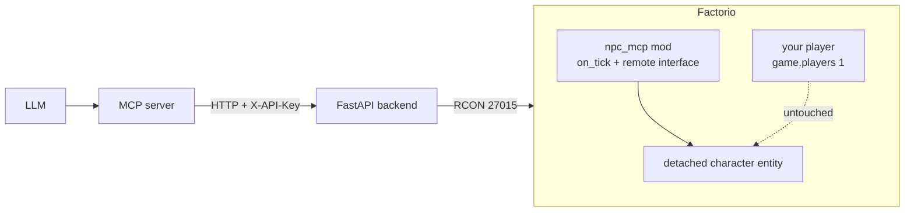

# factorio_npc_mcp

An experimental [Model Context Protocol](https://www.anthropic.com/news/model-context-protocol) (MCP) server for driving **NPC-like agents inside Factorio** via Claude Desktop prompting.

> **Inspiration / credit:** This project is inspired by [jerome3o/factorio-mcp](https://github.com/jerome3o/factorio-mcp). That project provides the original blueprint of "MCP server → HTTP backend → Factorio RCON" that this repo builds on. Go give it a star.

## Goal

Where the upstream project focuses on giving Claude *server-admin* tools (teleport, give items, screenshots, raw Lua), `factorio_npc_mcp` aims to expose tools and prompts that let an LLM act as an **autonomous in-game NPC / agent** — perceiving the world, planning, and taking actions through Factorio's RCON + Lua interface.

## Status

v0 scaffolding present: Factorio mod, RCON-proxy backend, MCP server, install scripts.
Not yet validated against a live Factorio install — see "Bring-up & validation" below.

## Repo layout

```
mod/npc_mcp/        Factorio mod (control.lua, info.json) — junctioned into Factorio mods dir
backend/            FastAPI HTTP proxy around RCON (X-API-Key auth)
mcp/                FastMCP server exposing npc_* tools to the LLM
scripts/            PowerShell helpers: install-mod, install-deps, start-backend, start-mcp
.env.example        Copy to .env and fill in
.reference/         (gitignored) cloned upstream repos for study
```

## Architecture



Your keyboard always drives `game.players[1]`. The NPC is a separate
`character` entity created with `surface.create_entity{name="character", ...}`
and is **not attached to any LuaPlayer**, so it cannot conflict with your
input or window focus. No synthetic keypresses are ever sent.

## Bring-up & validation

See **[SETUP.md](SETUP.md)** for the full step-by-step guide (prerequisites,
secrets, dedicated-server launch, Claude Desktop registration, common issues).

Short version, once you've done the one-time setup:

```powershell
.\scripts\start-factorio-server.ps1   # terminal 1 - dedicated server + RCON
.\scripts\start-backend.ps1           # terminal 2 - HTTP -> RCON proxy
# (Claude Desktop launches the MCP server itself once registered)
```

Then drive Botty from Claude using the `factorio-npc` MCP tools, and
optionally connect your Steam Factorio GUI to `127.0.0.1` to watch.

## Available MCP tools

| Tool | Purpose |
|---|---|
| `npc_spawn(name?, dx?, dy?)` | Create the NPC near you. Idempotent. |
| `npc_despawn()` | Remove it. |
| `npc_rename(name)` | Update the floating nameplate. |
| `npc_status()` | Exists? Where? Doing what? |
| `npc_walk(direction)` | Continuous walk: `north` / `east` / `south` / `west`. |
| `npc_walk_to(x, y)` | Naive straight-line walk to absolute coords. |
| `npc_mine_at(x, y)` | Start mining whatever's at that position. |
| `npc_stop()` | Cancel current intent. |
| `npc_say(text)` | Chat as the NPC. |
| `npc_look(radius=16)` | Perception: position + nearby entities. |
| `npc_inventory()` | Main inventory contents. |
| `npc_give(item, count, quality?)` | Dev helper: insert items directly. |

## Known v0 limitations

- `walk_to` is dumb straight-line stepping. Real pathfinding via `surface.request_path` is the obvious next step.
- Mining requires the target to be within reach distance; no auto-approach yet.
- No building/crafting tools yet.
- Single NPC only (`storage.npc`). Multi-NPC would key on `unit_number`.

## Relationship to `jerome3o/factorio-mcp`

The upstream repo contributes the core pattern this project reuses:

- A small **FastAPI backend** (`backend/rcon_server.py`) that wraps `mcrcon` behind an `X-API-Key`-protected `POST /execute_command` endpoint, isolating the RCON password from the MCP layer.
- A **FastMCP server** (`factorio_mcp.py`) exposing high-level tools to the LLM (`execute_command`, `run_lua`, `send_message`, `give_items`, `teleport_player`, `get_player_info`, `take_screenshot`, `get_player_count`) plus a `help_prompt`.
- A convention of routing everything through `run_lua` so actions can be announced in-game with an `explanation` string.

This repo will diverge by adding **perception tools** (entity/inventory/world queries), **agent-oriented prompts**, and likely a tighter feedback loop than the upstream's single-shot command model.

## License & attribution

Code patterns derived from `jerome3o/factorio-mcp` are credited to its author. Please consult that repository for its license terms before reusing code across projects.
