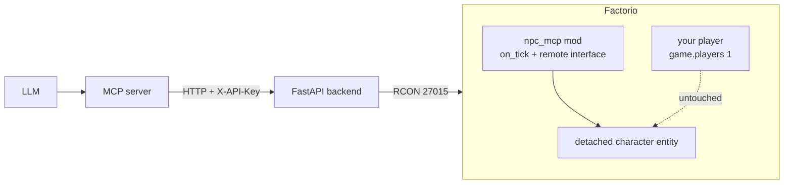

# factorio_npc_mcp

An experimental [Model Context Protocol](https://www.anthropic.com/news/model-context-protocol) (MCP) server for driving **NPC-like agents inside Factorio** via Claude Desktop prompting.

> **Inspiration / credit:** This project is inspired by [jerome3o/factorio-mcp](https://github.com/jerome3o/factorio-mcp). That project provides the original blueprint of "MCP server → HTTP backend → Factorio RCON" that this repo builds on. Go give it a star.

## Goal

Where the upstream project focuses on giving Claude *server-admin* tools (teleport, give items, screenshots, raw Lua), `factorio_npc_mcp` aims to expose tools and prompts that let an LLM act as an **autonomous in-game NPC / agent** — perceiving the world, planning, and taking actions through Factorio's RCON + Lua interface.

## Gameplay


## Status

v0 scaffolding present: Factorio mod, RCON-proxy backend, MCP server, install scripts.
Not yet validated against a live Factorio install — see "Bring-up & validation" below.

## Repo layout

```
mod/npc_mcp/        Factorio mod (control.lua, info.json) — junctioned into Factorio mods dir
backend/            FastAPI HTTP proxy around RCON (X-API-Key auth)
mcp/                FastMCP server exposing npc_* tools to the LLM
scripts/            PowerShell helpers: install-mod, install-deps, start-backend, start-mcp
.env.example        Copy to .env and fill in
.reference/         (gitignored) cloned upstream repos for study
```

## Architecture



Your keyboard always drives `game.players[1]`. The NPC is a separate
`character` entity created with `surface.create_entity{name="character", ...}`
and is **not attached to any LuaPlayer**, so it cannot conflict with your
input or window focus. No synthetic keypresses are ever sent.

## Bring-up & validation

See **[SETUP.md](SETUP.md)** for the full step-by-step guide (prerequisites,
secrets, dedicated-server launch, Claude Desktop registration, common issues).

Short version, once you've done the one-time setup:

```powershell
.\scripts\start-factorio-server.ps1   # terminal 1 - dedicated server + RCON
.\scripts\start-backend.ps1           # terminal 2 - HTTP -> RCON proxy
# (Claude Desktop launches the MCP server itself once registered)
```

Then drive Botty from Claude using the `factorio-npc` MCP tools, and
optionally connect your Steam Factorio GUI to `127.0.0.1` to watch.

## Available MCP tools

The Factorio-side mod auto-spawns Botty on server boot, so you can start
driving immediately. All tools below are implemented; see
[mod/npc_mcp/PLAN.md](mod/npc_mcp/PLAN.md) for the in-game side.

**Lifecycle:** `npc_spawn`, `npc_despawn`, `npc_rename`, `npc_save`

**Perception:** `npc_observe(radius=16)` (default), `npc_status`,
`npc_look`, `npc_look_at`, `npc_inventory`, `npc_drain_events`,
`npc_screenshot`, `npc_chart`, `npc_map_summary`,
`npc_research_status`, `npc_tech_tree`

**Movement:** `npc_walk_to` (async A*-pathfinding),
`npc_walk(direction)`, `npc_stop`

**Gathering:** `npc_mine_at(x, y)` (auto-approaches into reach)

**Crafting** (simulated hand-craft, no player required):
`npc_craft(recipe, count)`, `npc_craft_status`, `npc_cancel_craft`

**Building:** `npc_place(item, x, y, direction=0)`, `npc_pickup`,
`npc_rotate`, `npc_set_recipe`

**Logistics:** `npc_insert_into`, `npc_take_from`, `npc_fuel`

**Research:** `npc_research(tech)`

**Combat:** `npc_equip(armor, gun, ammo)`, `npc_shoot_at`

**Chat / cheats:** `npc_say`, `npc_give`

## Known v0 limitations

- Single NPC only (`storage.npc`). Multi-NPC would key on `unit_number`.
- The simulated hand-craft queue uses `recipe.energy * 60` as crafting
  ticks at speed 1.0; it does not honor `character_crafting_speed_modifier`.
- Event channel is pull-only (`npc_drain_events`); no SSE stream yet.

## Relationship to `jerome3o/factorio-mcp`

The upstream repo contributes the core pattern this project reuses:

- A small **FastAPI backend** (`backend/rcon_server.py`) that wraps `mcrcon` behind an `X-API-Key`-protected `POST /execute_command` endpoint, isolating the RCON password from the MCP layer.
- A **FastMCP server** (`factorio_mcp.py`) exposing high-level tools to the LLM (`execute_command`, `run_lua`, `send_message`, `give_items`, `teleport_player`, `get_player_info`, `take_screenshot`, `get_player_count`) plus a `help_prompt`.
- A convention of routing everything through `run_lua` so actions can be announced in-game with an `explanation` string.

This repo will diverge by adding **perception tools** (entity/inventory/world queries), **agent-oriented prompts**, and likely a tighter feedback loop than the upstream's single-shot command model.

## License & attribution

Code patterns derived from `jerome3o/factorio-mcp` are credited to its author. Please consult that repository for its license terms before reusing code across projects.
