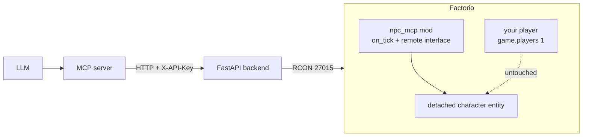

# Architecture

Your keyboard always drives `game.players[1]`. The NPC is a separate
`character` entity created with `surface.create_entity{name="character", ...}`
and is **not attached to any LuaPlayer**, so it cannot conflict with your
input or window focus. No synthetic keypresses are ever sent.

## The layers

| Layer | Lives in | Responsibility |
|-------|----------|----------------|
| LLM client | Claude Desktop / any MCP client | Decides actions, calls `npc_*` tools. |
| MCP server | [../mcp/factorio_npc_mcp.py](../mcp/factorio_npc_mcp.py) | Exposes `npc_*` tools/prompts; turns each call into one Lua `remote.call` over HTTP. |
| HTTP backend | [../backend/rcon_server.py](../backend/rcon_server.py) | FastAPI proxy that wraps RCON behind an `X-API-Key` header, isolating the RCON password from the MCP layer. |
| Factorio mod | [../mod/npc_mcp/control.lua](../mod/npc_mcp/control.lua) | Owns persistent NPC state, runs the per-tick dispatcher, and exposes the `remote.call("npc", fn, ...)` interface. See [../mod/npc_mcp/PLAN.md](../mod/npc_mcp/PLAN.md). |

The agent is blind between calls, so every remote function returns a JSON
string in one round-trip. Continuous behaviour (walking, mining, crafting)
lives in the mod's `on_tick` because RCON commands are one-shot.
